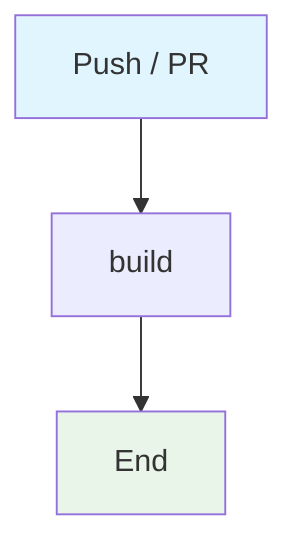

## Workflow Overview

**Purpose**: Install Node dependencies, optionally lint, then build.
**Trigger Events**: Push and pull requests to configured default branches.
**Target Environments**: Ephemeral Ubuntu CI.

## Execution Flow Diagram

## Jobs & Dependencies

| Job Name | Purpose | Dependencies | Execution Context |
|---|---|---|---|
| build | Install, lint if present, build | none | ubuntu-latest / Node 20 |

## Requirements Matrix

| ID | Requirement | Priority | Acceptance Criteria |
|---|---|---|---|
| REQ-001 | Reproducible install | High | Uses npm ci or npm install |
| REQ-002 | Build must succeed | High | `npm run build` exits 0 |
| REQ-003 | Lint is optional | Medium | Missing lint script does not fail |

## Secrets & Variables

None. No deploy credentials.

## Change Management

| Version | Date | Changes | Author |
|---|---|---|---|
| 1.0 | 2026-08-23 | Initial specification | fleet audit |
